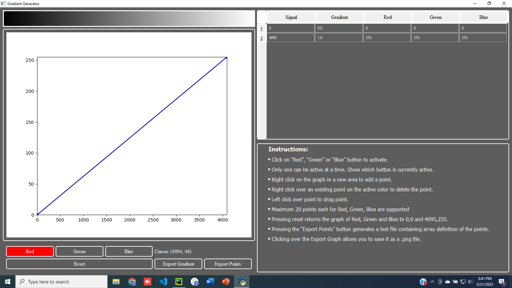

# Piece wise Linear Gradient Descent
<u>This is Piecewise Linear Gradient Generator for 12-bit Data</u>

**Description:** 
This project is about to generate the Linear gradient interactively using the cursor on x-y plane.

* Input data is 12-bit resolution (0-4095)
* Input data can be drawn with a color calculated from its value. 
* The set of up to 20 stops with will define the gradients for red, green, and blue channels. 
* The points are defined by adding, dragging, or removing points on a graph. 
* Color values can only be dragged up and down. The x-coordinate of the stop can be changed by dragging a stop marker on the x-axis left or right. 
* A preview of the gradient will update in real time as changes are made to the points on the graph. 
* A table defining all the points in the graph will also be updated as changes are made to the graph. 
* Typing new numbers into the table updates the graph and gradient. 
* The points can be exported to a text file. 
* The gradient preview can be saved as an image file. 
* The program must run in Python 3.7 or higher

### Here are some of the working images and videos of the Complete project

* <a href="https://github.com/abdullah0307/Piecewise-Linear-Gradient-Generator">Github</a>
* <a href="">Demo Video</a>
* <a href="">Website</a>